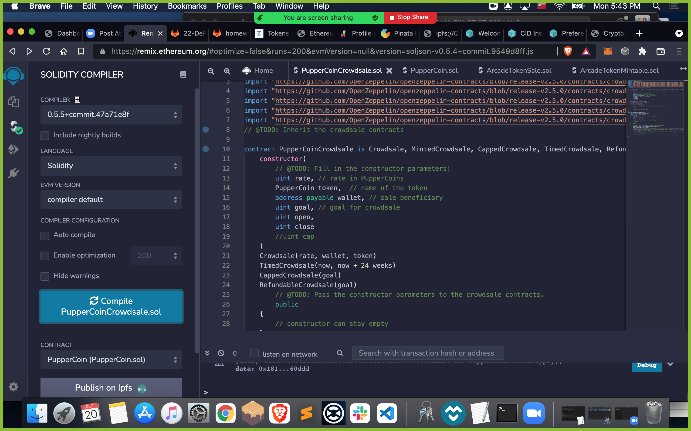

# AdvancedSolidity
advanced solidity homework 

 
 

## After coding is complete, compile the contract...

## After inputing the appropriate information, deploy the contract...

## Confirm the contract has been deployed...

## Once the contract has been deployed, toggle the contact from the deployer to the actual crowdsale...

## Test the crowdsale by sending test ETH to a different address...

## Finally, Check the transaction history to confirm the contract was created successfully!

